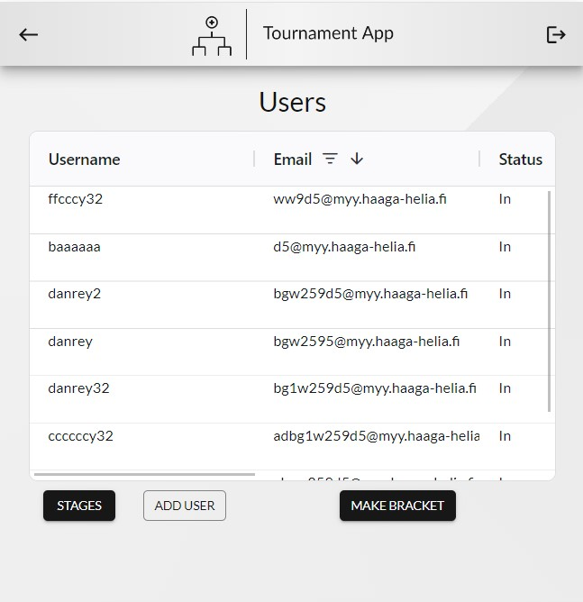

# Tournament App Front-end

> This React.js application serves as the client-side interface for a comprehensive tournament management system.<br> 
> Seamlessly designed for user interaction, it offers a range of functionalities to cater to both tournament participants and administrators.<br>
>
> The back-end side can be found [here](https://github.com/alexonthespot7/Tournament_back-end)<br>
> The production version of the application can be found under the [production branch](https://github.com/alexonthespot7/Tournament_front-end/tree/production)<br>

## Table of Contents
* [Usage Guide](#usage-guide)
* [Features](#features)
* [Technologies Used](#technologies-used)
* [Dependencies](#dependencies)
* [Screenshots](#screenshots)

## Usage Guide
1. Back-end: To start application you should first run the back-end app on your computer
    1. Clone the project <br>```git clone https://github.com/alexonthespot7/Tournament_back-end.git```<br>
    2. Set the environmental variables<br>
To activate smtp service functionality you will need to set the following env variables with some real data.<br>For that run the following commands in the command line (or configure env variables in application.properties file):<br>
    ```$Env:SPRING_MAIL_HOST="your_smtp_host"```<br>
    ```$Env:SPRING_MAIL_USERNAME="your_smtp_username"```<br>
    ```$Env:SPRING_MAIL_PASSWORD="your_smtp_password"```<br>
    3. Run the following command in a terminal window (in the complete) directory:<br>
```./mvnw spring-boot:run```<br>
2. Front-end: After the back-end app was successfully launched you can run the front-end side
    1. Clone the project <br>```git clone https://github.com/alexonthespot7/Tournament_front-end.git```<br>
    2. run the following command in a terminal window (in the complete) directory:<br>
```npm install```<br>
    3. run the following command in a terminal window (in the complete) directory:<br>
```npm start```<br>
    4. Navigate to localhost:3000
  
ADMIN credentials:<br>
* password: asas2233<br>
* username: admin

## Features
### For User
- Bracket Tracking: Users can easily follow the tournament's progress through intuitive bracket visualization.
  
- Round and Competitor Details: Access comprehensive information about rounds, competitors, and their progression through stages.

- Personal Data Management: Users can conveniently manage their personal data within the application.

### For Admin

- Bracket Creation: Administrators can create tournament brackets efficiently using the application's interface.

- User Management: Add, edit, or remove user accounts, providing a streamlined process for user administration.

- Result Management: Set and update results for rounds and stages, ensuring accurate progress tracking within the tournament.

## Technologies Used
- React.js
- css

## Dependencies
- [@mui/icons-material](https://www.npmjs.com/package/@mui/icons-material) (^5.14.18): Material-UI Icons library for customizable icons following Material Design guidelines.
- [@mui/material](https://www.npmjs.com/package/@mui/material) (^5.14.18): Material-UI framework providing pre-designed React components.
- [ag-grid-react](https://www.npmjs.com/package/ag-grid-react) (^31.0.0): React wrapper for AG-Grid to seamlessly integrate its functionalities.
- [js-cookie](https://www.npmjs.com/package/js-cookie) (^3.0.5): Simplifies working with cookies in JavaScript.
- [react-router-dom](https://www.npmjs.com/package/react-router-dom) (^6.20.1): Declarative routing for navigation and view handling in React.
- [react-svg-pan-zoom](https://www.npmjs.com/package/react-svg-pan-zoom) (^3.12.1): React component library enabling panning and zooming for SVG elements.

## Screenshots
<p align="center">
  
  
  
  
  
  
  
  
  
</p>
